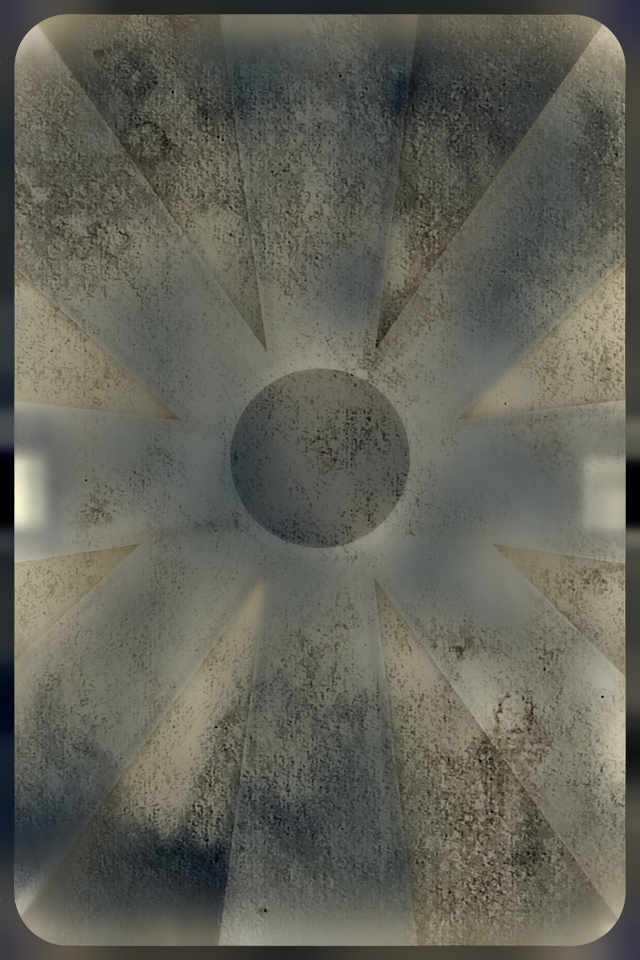

# Mask from the difference of images
Based on two images, calculates the image mask that must be applied over the original image to get the desired image.
# Example
### Original image

### Image with mask (the filter generated by the neural network)

### Image mask
